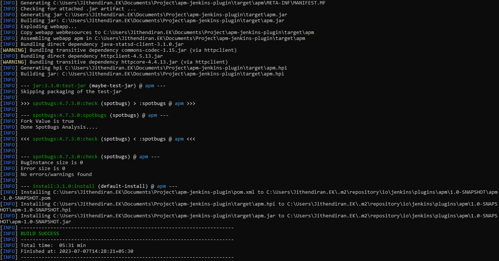
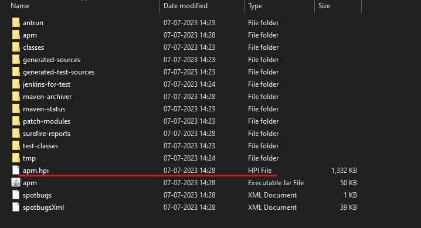
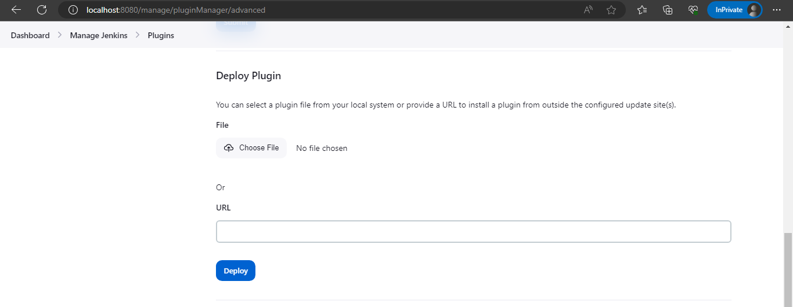
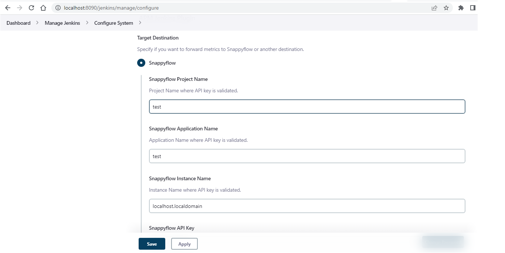

# Steps to make local setup for initial testing
# 1. Jenkins install on Windows
--------------------------------
https://www.jenkins.io/doc/book/installing/windows/  
https://www.jenkins.io/doc/book/installing/windows/#invalid-service-logon-credentials  

# 2. Maven install on Windows  
---------------------------------
https://maven.apache.org/install.html  

Step 1: To generate a new jenkins-plugin project from scratch  
mvn archetype:generate -Dfilter=io.jenkins.archetypes:plugin  

Step 2: To update to the latest Jenkins's versions  
mvn versions:update-parent  

Step 3: To test development changes locally  
mvn clean hpi:run -Djetty.port=8090  
# 3. To extend the plugin.
  1. [Clone the Repo](https://github.com/maplelabs/apm-jenkins-plugin) 

  2. Navigate to the plugin folder and run `mvn clean install`
  

  3. After the build succed artifact file will be generated on the location /target  folder (`.hpi`)
  

  4. Upload the hpi file in jenkin's manage jenkins page `http://localhost:8080/manage/pluginManager/advanced` under **Deploy Plugin** option
  

  5. Click choose file and upload the hpi file and click deploy

  6. Once the process is over restart jenkins

  7. Options are listing under jenkin's configure page
  

# Useful docs to develop or improve Jenkins-plugin  
---------------------------------------------------  
https://www.jenkins.io/blog/2022/09/21/improve-a-plugin-tutorial/  
https://docs.google.com/document/d/1PKYIpPlRVGsBqrz0Ob1Cv3cefOZ5j2xtGZdWs27kLuw/edit#heading=h.16lrdvhr0hro  
https://wiki.jenkins.io/display/JENKINS/Plugin+Cookbook  
https://www.jenkins.io/doc/book/getting-started/  
https://github.com/jenkinsci/schedule-build-plugin/blob/master/pom.xml  --> reference for compatiable and latest versions
https://medium.com/@pavithra_38952/managing-and-monitoring-jenkins-6df681813c0a  ---> How to add multiple agent nodes on jenkins master

# Recording on POC code:
[Code Deep dive](https://maplelabsblr-my.sharepoint.com/:v:/g/personal/bhagavad_geetha_maplelabs_com/EfH9q6bkdgJAkm2CF9Xh2SAB2ITehBjhNao7qsmOREm2aw?e=Zhd4Yu)

